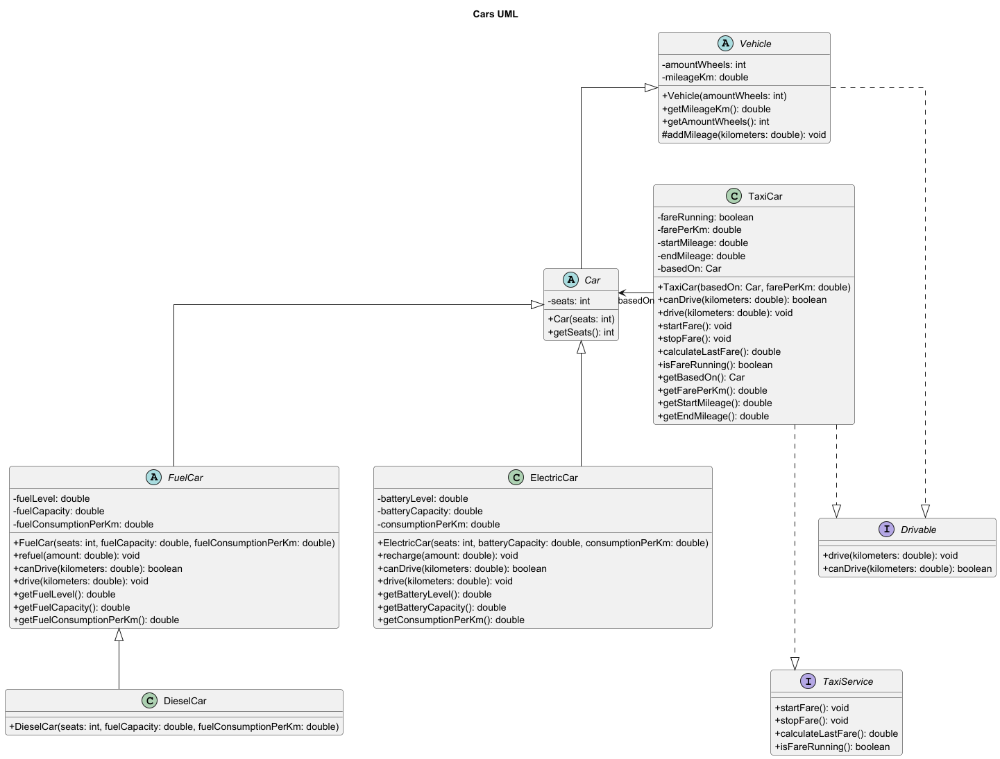

# 🚗 Java: Vehicle Hierarchy & Taxi Features

> Ein Java-Projekt zur Modellierung einer Fahrzeugklassenhierarchie mit **Vererbung**, **Polymorphismus**, **Interfaces** und **UML-basierter Struktur**.

## 📌 Kurzbeschreibung

Dieses Projekt realisiert eine kleine, klar strukturierte Fahrzeugverwaltung in Java.  
Verschiedene Fahrzeugtypen werden in einer gemeinsamen Klassenhierarchie abgebildet und über einheitliche Schnittstellen gesteuert.

Der Fokus liegt auf der **sauberen Umsetzung objektorientierter Konzepte** und der **strukturierten Modellierung mit UML**.

## ✨ Was das Projekt realisiert

Das Projekt implementiert:

- eine **allgemeine Fahrzeug-Basisklasse**
- eine **Vererbungshierarchie** für verschiedene Fahrzeugtypen
- **spezialisierte Fahrlogik** für Elektro- und Tankfahrzeuge
- ein **Taxi-Modell** mit zusätzlicher Service-Funktionalität
- die **Kopplung von Code und UML-Klassendiagramm**

## ⚙️ Automatisierung und Verbesserung

Dieses Projekt automatisiert und vereinfacht folgende Abläufe:

- **einheitliche Fahrprüfung** über `canDrive(...)`
- **automatische Aktualisierung** von Kilometerstand, Akku- und Tankstand
- **klare Trennung** zwischen allgemeiner Fahrzeuglogik und spezialisiertem Verhalten
- **Wiederverwendbarkeit** durch abstrakte Klassen und Interfaces
- **Erweiterbarkeit** für weitere Fahrzeugtypen ohne grundlegenden Umbau

Dadurch verbessert das Projekt:

- die **Strukturierbarkeit** des Codes
- die **Wartbarkeit**
- die **Nachvollziehbarkeit der Beziehungen zwischen Klassen**
- die **Umsetzung von OOP-Prinzipien in der Praxis**

## 🧱 Klassen und Interfaces

- `Vehicle` – abstrakte Basisklasse für Fahrzeuge
- `Car` – abstrakte Klasse für Autos
- `FuelCar` – abstrakte Klasse für Fahrzeuge mit Tank
- `DieselCar` – konkrete Unterklasse von `FuelCar`
- `ElectricCar` – konkrete Unterklasse von `Car`
- `TaxiCar` – Taxi auf Basis eines Autos
- `Drivable` – Interface für fahrbare Objekte
- `TaxiService` – Interface für Taxifunktionen
- `Traffic` – Demo-Klasse

## 🖼️ UML-Diagramm



## 📂 Projektstruktur

```text
Cars/
├─ src/
│  └─ cars/
│     ├─ Vehicle.java
│     ├─ Car.java
│     ├─ FuelCar.java
│     ├─ DieselCar.java
│     ├─ ElectricCar.java
│     ├─ Drivable.java
│     ├─ TaxiService.java
│     ├─ TaxiCar.java
│     └─ Traffic.java
├─ README.md
├─ CarsUML.png
├─ CarsUML.puml
└─ .gitignore