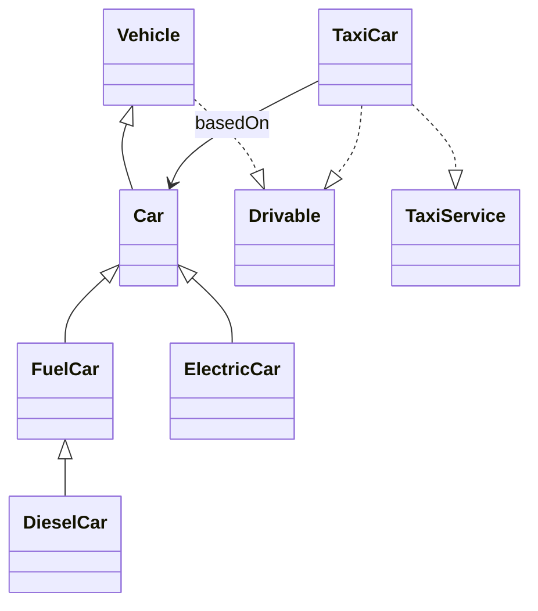

# Cars

Ein Java-Projekt zur Vererbung, Interfaces und Komposition.

## Beschreibung
Dieses Projekt modelliert verschiedene Fahrzeugtypen mit objektorientierter Programmierung in Java.  
Der Fokus liegt auf Vererbung, abstrakten Klassen, Interfaces und Komposition.

## Klassen und Interfaces
- `Vehicle` – abstrakte Basisklasse für Fahrzeuge
- `Car` – abstrakte Klasse für Autos
- `FuelCar` – abstrakte Klasse für Autos mit Tank
- `DieselCar` – konkrete Unterklasse von `FuelCar`
- `ElectricCar` – konkrete Unterklasse von `Car`
- `TaxiCar` – Taxi auf Basis eines `Car`
- `Drivable` – Interface für fahrbare Objekte
- `TaxiService` – Interface für Taxifunktionen
- `Traffic` – Demo-Klasse

## Projektstruktur

```text
Cars/
├─ src/
│  └─ cars/
│     ├─ Vehicle.java
│     ├─ Car.java
│     ├─ FuelCar.java
│     ├─ DieselCar.java
│     ├─ ElectricCar.java
│     ├─ Drivable.java
│     ├─ TaxiService.java
│     ├─ TaxiCar.java
│     └─ Traffic.java
├─ README.md
└─ .gitignore


## UML Diagram

